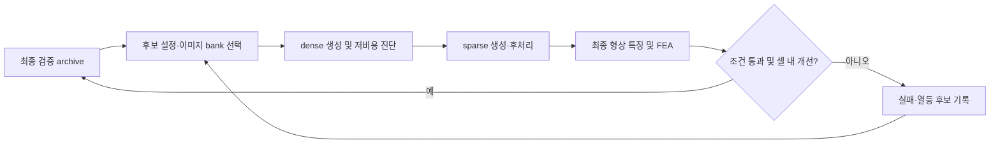

# 3d_qd에 Quality-Diversity를 적용하기 위한 문헌 조사

조사일: 2026-09-13. 논문 원문·공식 학회 페이지·저자 프로젝트·공식 구현 문서를 우선 확인했다. 아래의 적용 제안은 선행연구에서 우리 파이프라인으로 확장한 판단이며, 구현하거나 성능을 검증한 결과가 아니다. 검색 범위 내 조사이므로 최초성이나 문헌의 완전성을 보장하지 않는다.

후속 기록: 이 문서는 QD 구현 이전 조사 시점의 상태를 보존한다. 이후 실행 코드는 `/home/goya/SDL/3d_qd/codebase/run_qd_pilot.py`, 실험 상태는 `/home/goya/SDL/3d_qd/experiments/bracket/qd_pilot_2026-09-13/summary.json`에 있다. 추가로 확인한 LMTO의 실제 3D 적용과 투고 실험 계획은 `/home/goya/SDL/3d_qd/codebase/docs/publication_experiment_plan_2026-09-13.md`를 따른다.

## 판단

현재 가장 현실적인 출발점은 **최종 3D와 FEA로 검증하는 작은 MAP-Elites archive**다. 저비용 후보 선별을 검증한 뒤 **제약·혼합변수 Bayesian QD**를 추가하는 순서가 적합하다. DQD는 연구 확장으로 유망하지만 현재 파이프라인 전체가 미분가능하다고 가정해서는 안 된다.

별도 논문의 연구 질문 후보는 다음과 같다.

> 이미지 조건부 3D 생성에서, 생성 단계 사이에 변하는 형상 특징을 추적·보정하면서 제한된 계산 예산으로 물리적으로 유효한 설계 다양성을 확보할 수 있는가?

단순히 QD와 FEM을 결합하거나 생성 모델 latent를 gradient로 탐색하는 것만으로는 신규성을 주장하기 어렵다. QDID/OIDD, LSI/DQD, Bayesian QD가 각각 관련 선행연구다. [R4–R5, R8–R11]

## 핵심 문헌과 적용 관계

| ID | 연구 / 확인된 연도 | 핵심 내용 | 이 프로젝트에서의 의미 |
|---|---|---|---|
| R1 | Mouret & Clune, *Illuminating search spaces by mapping elites*, 2015 | 특징 공간의 각 구역에 좋은 해를 저장하는 MAP-Elites | 외부 탐색 루프의 기본 비교군. [논문](https://arxiv.org/abs/1504.04909) |
| R2 | Vassiliades et al., *Using Centroidal Voronoi Tessellations…*, 2016 preprint | 특징 차원과 별개로 archive 구역 수를 지정하는 CVT-MAP-Elites | 특징 축이 늘 때 유용하나, 적은 평가로 모든 구역을 채운다는 보장은 아님. [논문](https://arxiv.org/abs/1610.05729) |
| R3 | Gaier, Asteroth & Mouret, *Data-Efficient Design Exploration through Surrogate-Assisted Illumination*, 2018 | 대리모델을 활용한 설계 공간 탐색 SAIL | 비싼 실제 평가를 줄이는 출발점. 예측 archive와 실제 검증 archive를 구별할 필요. [논문](https://arxiv.org/abs/1806.05865) |
| R4 | Fontaine et al., *Illuminating Mario Scenes in the Latent Space of a Generative Adversarial Network*, AAAI 2021 | GAN latent를 QD로 탐색하는 Latent Space Illumination | 생성 latent에 QD를 붙이는 아이디어의 직접 선행연구. [학회 원문](https://ojs.aaai.org/index.php/AAAI/article/view/16740) |
| R5 | Fontaine & Nikolaidis, *Differentiable Quality Diversity*, NeurIPS 2021 | 목적·특징 gradient를 이용하는 MEGA 계열; StyleGAN latent 실험 포함 | 생성 모델+gradient QD 자체는 이미 존재. 우리 FEM sensitivity와 최종 결과 gradient를 구분해야 함. [학회 원문](https://papers.nips.cc/paper_files/paper/2021/hash/532923f11ac97d3e7cb0130315b067dc-Abstract.html) |
| R6 | Pierrot et al., *Multi-Objective Quality Diversity Optimization*, GECCO 2022 | MOME: 각 특징 구역에 하나의 해 대신 지역 Pareto front 저장 | 강성·질량 등의 trade-off를 동시에 보존할 후속 방법. [논문](https://arxiv.org/abs/2202.03057) |
| R7 | Fontaine & Nikolaidis, *Covariance Matrix Adaptation MAP-Annealing*, 2022 preprint | CMA-MAE: 품질 개선과 특징 탐색 간 적응 방식 개선 | 연속형 저차원 탐색 벡터를 만들었을 때의 강한 비교군. 범주형 prompt ID를 연속 수처럼 처리하지 말 것. [논문](https://arxiv.org/abs/2205.10752) |
| R8 | Kent et al., *BOP-Elites…*, 2023 preprint / 2024 TEVC | 목적과 특징을 GP로 모델링하고 acquisition으로 평가점 선택 | 특징도 생성 후에야 알 수 있는 비싼 black-box 탐색과 잘 맞음. [논문](https://arxiv.org/abs/2307.09326), [저자 구현](https://github.com/kentwar/BOPElites) |
| R9 | Brevault & Balesdent, *Bayesian Quality-Diversity approaches for constrained optimization problems with mixed continuous, discrete and categorical variables*, 2024 | 제약과 연속·이산·범주형 변수를 포함하는 Bayesian QD | prompt category + 연속 guidance + 정수 선택의 혼합 탐색에 가장 직접적. 보고된 비용 절감은 해당 실험의 결과이며 우리 문제의 보장치가 아님. [출판사](https://www.sciencedirect.com/science/article/pii/S0952197624002768) |
| R10 | Xie, Pinskier, Wang & Howard, *Evolutionary Seeding of Diverse Structural Design Solutions via Topology Optimization*, ACM TELO 2024 | QDID: 다양한 초기 설계 탐색과 SIMP를 결합, 구조 문제 실험 | QD+구조 최적화의 직접 비교 대상. [DOI](https://doi.org/10.1145/3670693), [저자 소속기관 서지·초록](https://researchprofiles.canberra.edu.au/en/publications/evolutionary-seeding-of-diverse-structural-design-solutions-via-t/) |
| R11 | Xie et al., *A 'MAP' to find high-performing soft robot designs…*, 2024 preprint | OIDD: 설계 영역의 void 크기·위치를 진화시키고 내부 topology optimization 실행 | 외부 QD + 내부 물리 최적화 구조가 매우 가까움. 이미지 prior와 기존 CAD·BC 보존의 차이를 실험해야 함. [원문](https://arxiv.org/html/2407.07591v1) |
| R12 | Flageat & Cully, *Uncertain Quality-Diversity…*, 2023 preprint | 목적·특징이 확률적으로 달라지는 문제, archive 재평가와 평가 예산 | 반복 실행에서 관측된 변동을 고려한 elite 검증 설계. [논문](https://arxiv.org/abs/2302.00463) |
| R13 | Ding et al., *Quality Diversity through Human Feedback…*, ICML 2024 | 사람의 유사성 판단으로 다양성 척도를 학습; diffusion 이미지 생성 실험 | '카고메·리브·유기적 형태가 얼마나 다른가'를 다룰 후속 방향. 강성 평가는 FEA로 유지. [학회 원문](https://proceedings.mlr.press/v235/ding24h.html) |
| R14 | *Generative Design through Quality-Diversity Data Synthesis and Language Models*, 2024 | QD로 생성한 설계 데이터를 언어모델 기반 생성에 활용 | 장기적으로 archive를 데이터셋으로 재사용하는 방향. GPT 이미지 편집→3D→FEA를 직접 검증한 연구로 해석하면 안 됨. [저자기관 PDF](https://www.research.autodesk.com/app/uploads/2024/05/TileGPT_GECCO.pdf) |
| R15 | Hedayatian & Nikolaidis, *Soft Quality-Diversity Optimization*, ICLR 2026 | 이산 구역을 쓰지 않는 Soft QD와 미분가능 알고리즘 SQUAD | 고차원 특징 공간으로 확장할 때 조사할 최신 방법. 현재 2D 파일럿의 필수 구성은 아님. [학회 원문](https://proceedings.iclr.cc/paper_files/paper/2026/hash/79eb0ed60c0660fc2fbe4a2bf75cf4cc-Abstract-Conference.html) |
| R16 | Tjanaka et al., *Discount Model Search for Quality Diversity Optimization in High-Dimensional Measure Spaces*, ICLR 2026 | DMS: 연속 discount 모델로 탐색; 이미지 데이터로 목표 특징을 지정하는 QDDM | 스타일 참조 이미지 집합으로 다양성을 정의하려는 장기 방향과 관련. 최종 3D 렌더에 적용하는 것은 우리의 확장 제안. [논문](https://arxiv.org/abs/2601.01082), [저자 프로젝트](https://discount-models.github.io/) |

우선 정독 순서는 **R9 → R10/R11 → R5 → R8 → R12**를 권한다. 구현 골격은 R1, 최신 시각적 다양성 방향은 R13/R16이다. R10은 출판사 직접 열기가 403으로 제한되어 검색에 노출된 방법 부분과 저자 소속기관 기록을 함께 확인했다. 표의 preprint 연도와 학회·저널 출판 연도는 구분했다.

기존 overview도 유효하다: Chatzilygeroudis et al., *Quality-Diversity Optimization: A Novel Branch of Stochastic Optimization*, 2021, DOI https://doi.org/10.1007/978-3-030-66515-9_4. 로컬 PDF `/home/goya/SDL/3d_qd/references/00. Quality-Diversity Optimization.pdf`의 서두·정의를 확인했다.

## 현재 코드에서 확인한 연결 지점

| 역할 | 현재 파일 / 상태 | QD에서 할 일 |
|---|---|---|
| 개별 후보 실행 | `/home/goya/SDL/3d_qd/codebase/run_conditioning_case.py` | genotype를 설정 파일로 변환해 호출. 실제 이미지·설정 해시와 결과 경로를 archive에 연결 |
| 생성과 내부 물리 guidance | `/home/goya/SDL/3d_qd/codebase/code/generate_with_physics_guidance.py` | 초기에는 기존 동작을 evaluator로 사용. 후속으로 descriptor-target guidance 실험 |
| 단계별 성공 판정 | `/home/goya/SDL/3d_qd/codebase/run_from_image.py` | 실패한 후보를 정상 elite로 저장하지 않기 |
| 최종 메쉬 측정 | `/home/goya/SDL/3d_qd/codebase/evaluate_conditioning_case.py` | 특징과 validity 계산. 현재 두께·BC 근사는 설계 통과 기준으로 바로 쓰지 않기 |
| dense 재사용 | 생성 코드의 `save_dense_cache` / `load_dense_cache` | sparse 탐색에 재사용 가능. 캐시 고정 시 dense가 정하는 형태의 탐색 범위는 줄어듦 |
| 현재 관측 자료 | `/home/goya/SDL/3d_qd/experiments/caliper/conditioning_study/report.json` | 기존 결과로 descriptor 민감도와 stage drift 조사 |

현재 workspace에서 찾은 `fea_tet_summary.json`은 **8개**다. 기존 기획 문서에 적힌 '140개 기존 결과'는 이 위치에서 확인되지 않았다. 논문에 보고된 별도 데이터와 지금 사용할 수 있는 로컬 결과를 혼동하지 않아야 한다. 실행 가능한 QD archive/emitter 루프는 이번 검색에서 확인되지 않았고, QD 문서는 설계안이다.

## 기존 기획에서 정정할 부분

대상 문서: `/home/goya/SDL/3d_qd/codebase/docs/qd_extension.md`, `/home/goya/SDL/3d_qd/codebase/docs/qd_paper_concept.md`. 원문은 보존하고 이 조사 문서에서 정정한다.

1. **'DQD는 직접 파라미터 공간, 우리는 생성 prior'라는 차별화는 불충분하다.** R5는 StyleGAN latent 탐색을 포함한다. sampling 중간 개입의 가치, gradient 비용, 최종 특징 제어 정확도를 실제로 비교해야 한다.
2. **O(셀 수) 평가로 archive를 채운다는 보장은 없다.** 도달 불가능한 특징 조합, 비단사 매핑, 실패, 후처리 이동, 잡음이 존재한다. 셀 조준 성공률을 별도로 측정할 가설이다.
3. **MAP-Elites에 반드시 10⁴–10⁶ 평가가 필요한 것은 아니다.** 과제·archive 해상도·목표 coverage에 달려 있다. 작은 예산의 baseline을 실제로 만들어 비교해야 한다.
4. **dense의 특징을 최종 특징으로 간주하면 안 된다.** 이번 로컬 데이터에 이미 dense→최종 형상 이동이 있다. 저충실도 선별은 가능한 제안이지만 타당성이 자동 성립하지 않는다.
5. **raw genus를 기본 다양성 축으로 권하지 않는다.** `topology_fix` 결과의 genus 142와 얇은 부위 지표 0.832는 의미 있는 형태 다양성보다 미세 구멍에 민감한 지표가 될 수 있음을 보여준다.
6. **현재 FEM sensitivity는 최종 파이프라인 전체의 gradient가 아니다.** 코드에 detach, 외부 solver, marching cubes, boolean, remeshing이 있다. 내부 연속 밀도에 대한 surrogate guidance와 최종 검증 목적의 미분을 구분해야 한다.
7. **SIMP 단일 실행 1개 셀과 QD 다수 평가를 비교하면 예산이 불공정하다.** 다중 초기화 SIMP, QDID/OIDD류 비교 또는 동등한 기능의 구현을 같은 평가/GPU 시간으로 비교해야 한다.

## 적용 제안: 두 단계로 나눌 것

### 먼저 만들 QD

**탐색 대상 x**: 저장된 conditioning 세트 ID, 일부 연속 생성 설정, 샘플링 seed 또는 저차원 latent 조절값. 첫 실험은 3–6개 정도의 연속 변수와 작은 이미지 bank로 제한하는 것이 합리적이라는 제안이다. GPT 내부 latent나 gradient에 접근할 수 있다고 가정하지 않는다. Builtin 이미지 생성은 외부 후보 제안 단계로 두고, 실제 PNG를 고정·보관한 뒤 3D 탐색을 재현한다.

**고정할 문제 사양**: CAD domain, fix/load 형상과 하중, 재료 E/ν, 단위, 검증 FEA 설정. 이들을 genotype에 넣어 강성을 쉽게 높이거나 하중을 줄이는 해를 만들지 않는다. Bracket과 caliper는 다른 문제이므로 초기에는 별도 archive로 운영한다.

**품질 f**: 최종 검증 compliance 최소화. 예를 들어 사전에 정한 domain별 참조 C_ref로 `f = -C/C_ref`. 단순 QD-score 합은 음수 fitness에서 coverage 해석이 꼬일 수 있으므로, 보고용으로 고정된 기준을 이용해 양수 점수로 변환하거나 archive quality profile을 함께 보고한다. 변환식·범위·feasibility cutoff는 알고리즘 비교 전에 고정한다.

**특징 b**: 첫 후보는 `(재료 체적비, 정규화된 방향별 재료 분포/2차 모멘트)`. 체적비는 fixture 포함 여부와 domain 분모를 통일한다. 분포 축은 고정 CAD 좌표계에서 평가한다. 예를 들면 `sum(occ(x) * distance_to_axis(x)^2) / (sum(occ(x)) * L^2)`로 정규화할 수 있다. 이 축들이 독립적으로 반응하는지는 파일럿에서 확인해야 한다. 카고메·리브 등 시각적 특성은 초기에는 별도 태그와 최종 렌더 검사로 남긴다.

**조건 통과 여부**: 메쉬 유효성, 연결성, envelope, 장착·하중 영역 유지, 해석 성공을 먼저 확인한다. 최소두께·응력 제한은 사용할 측정법과 허용값이 정해진 경우에만 적용한다. 현재 EDT ridge 두께의 1.5 mm 바닥값이나 전체 BC 표면 근접률만으로 실제 최소두께·하중 전달을 판정할 수는 없다. 응력 최대값은 메쉬 민감도도 검토한다.

**archive**: 2D 4×4 같은 작은 고정 격자로 시작하는 제안이다. bin 범위는 별도 초기 표본으로 정하고 본 비교 전에 고정한다. 빈 셀을 억지로 채우기 위해 range를 사후 변경하지 않는다. 현재 8개 결과를 저장소에 넣는 것은 초기화/분석이지 그 자체로 진화적 QD 실행은 아니다.

저충실도 선별은 초기에 전부 통과시키거나 무작위 검증 표본을 남겨 false rejection을 측정한다. 이후 dense 특징·품질로 최종 특징·성능·성공확률을 예측한다. **최종 archive 셀은 최종 메쉬의 실제 특징으로 배정**한다. 예측값은 검증된 elite와 같은 지위를 갖지 않는다. [R3, R8, R9에서 동기를 얻은 적용 제안]

### 그다음 연구 확장

- **Bayesian QD**: 연속·범주형 설정에서 좋은 archive 개선과 성공 가능성을 함께 예측. 모든 GP에 고차원 PNG/전체 latent를 그대로 넣는 설계는 피하고, 작은 변수 집합부터 검증. [R8, R9]
- **DQD 기반 후보 제안**: 목표 체적·재료 분포의 differentiable proxy를 dense guidance에 추가. 최종 특징 오차를 학습하거나 반복 보정하는 방식과 단순 목표 guidance를 비교. 기존 C-gradient의 단위·정규화·정확성을 검증하고 gradient 계산 비용도 포함. [R5]
- **다목적 archive**: 질량도 최소화 목적이라면 MOME 도입 검토. 질량을 특징 축과 목적에 동시에 넣을 때의 의미를 명시하고, 형태 특징 축과 `(C, mass)` 목적을 분리하는 설계를 비교. [R6]
- **시각적 다양성**: 최종 3D의 고정 카메라 렌더에서 특징을 측정하고, QDHF나 DMS/QDDM 방식으로 스타일 참조 집합과 연결. 생성 입력 이미지만 평가하면 최종에서 사라진 카고메를 여전히 보상하게 된다. [R13, R16]

## 확률성과 예산을 어떻게 다룰 것인가

현재 같은 caliper 입력의 반복 결과는 C=30.871→40.267 mJ, 체적 약 -10.3%로 달랐다. 이는 두 번의 관측이며 분산의 신뢰성 있는 추정치는 아니다. 구분할 대상도 두 가지다.

- **고정된 최종 설계 archive**: elite는 설정만이 아니라 실제 OBJ/STL/이미지/해시를 보관한다. 같은 설정으로 재생성된 다른 형상은 별도 후보다. 동일한 최종 메쉬의 FEA 재평가는 solver/메쉬 민감도 확인이다.
- **재현 가능한 생성 recipe archive**: 설정의 반복 생성 성능을 평가하려면 생성부터 반복해야 한다. 평균 품질·성공률·특징의 셀 이동을 검증한다. 우연히 좋은 한 번의 생성만 저장하면 recipe를 과대평가할 수 있다. [R12]

초기에는 고정 최종 설계 archive를 권한다. 유망 recipe에만 추가 재생성 예산을 배정하되, 재평가 비용은 전체 예산에 포함한다.

로컬 caliper 비교 6건의 gen+post+FEA 시간은 **750–813초, 평균 781초(약 13분)**였다. 이미지 생성과 추가 분석 시간은 제외다. 이것으로 단순 환산하면 신규 32개는 약 6.9시간의 파이프라인 누적 실행시간, 64개는 약 13.9시간이다. GPU 3개로 이상적으로 나눌 경우 약 2.3/4.6시간이지만, 실제 wall time은 실패·동시 실행 자원 경쟁·재평가·이미지 생성에 따라 늘어난다. 논문의 샘플 효율 수치를 여기에 그대로 대입하지 않는다.

평가 보고 항목:

- 동일한 고정 특징 공간에서의 feasible coverage, 품질 분포, 최고 품질, 정의가 명시된 QD-score.
- full evaluation 수와 총 GPU/CPU wall time; 이미지 제안 비용과 재평가 비용 포함 여부.
- 후보 생성 실패율, FEA 실패율, geometric filter 탈락률을 따로 기록.
- dense→final 특징 오차, 목표 셀 도달률, 최종 셀 이동률.
- final-render 다양성과 실제 macro-hole 보존; raw genus만으로 다양성을 주장하지 않기.
- 반복 seed/실행에 따른 corrected archive 지표. MOME를 쓰면 동일 reference point와 정규화를 사용한 지역/전체 hypervolume.

비교군은 최소한 **동일 예산 random/Sobol 샘플링**, **기본 MAP-Elites**, **제안한 개선 방법**이다. 큐레이션 이미지 bank만 달라지는 비교, Bayesian 선별 유무, descriptor guidance 유무를 분리한다. 연구 범위를 topology optimization 대비까지 넓히면 같은 예산의 다중 초기화 SIMP 또는 QDID/OIDD류를 추가한다.

## 구현 도구

첫 구현은 Python evaluator를 재사용하기 쉬운 **pyribs**가 적합하다는 판단이다. 공식 문서에서 GridArchive/CVTArchive, ask/tell 방식의 scheduler, gradient emitter와 BOP-Elites 예제를 확인했다. 다만 공식 BOP-Elites 예제가 R9의 제약·혼합변수 방식까지 자동 제공한다고 가정해서는 안 된다. 설치·버전 변경은 이번 조사에서 수행하지 않았다. [공식 문서](https://docs.pyribs.org/en/stable/), [BOP-Elites 예제](https://docs.pyribs.org/en/stable/examples/bop_elites.html)

## 바로 이어서 할 수 있는 범위

1. 현재 8개 결과로 최종 체적·재료 분포·macro-hole·두께 지표의 민감도 확인. Bracket 표본은 1개라 별도 표본 확장이 필요.
2. final artifact를 저장하는 archive의 입출력·feasibility·점수 정의 확정.
3. 작은 4×4 archive와 제한된 이미지 bank로 MAP-Elites와 random baseline의 동등 예산 파일럿.
4. 특징 제어가 작동하고 저충실도 예측이 실제로 유효한지 확인한 뒤 Bayesian QD 또는 DQD 확대.

이번 턴의 산출물은 문헌 조사와 적용 설계안이다. QD 탐색이나 추가 GPU 생성은 실행하지 않았다.
